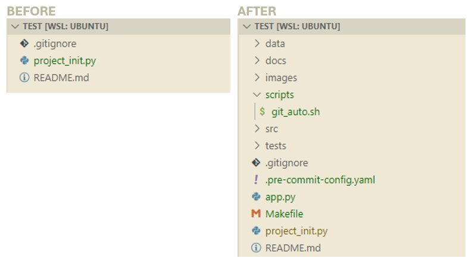

# project_initializer
Quick, dirty and customizable script to bootstrap a new project.

## Requirements
- An environment with Python ≥ 3.11
- Git initialized in the local rep

## Usage
Download and place "project_init.py" in the root directory of your project and execute it. After the execution you can delete the file.

## Features
- Detects OS (Windows or Linux only)
- Creates standard folders (docs, scripts...)
- Generates pre-filled config files:
  - git_auto.sh|bat depending on OS
  - pre-commit-hook.yaml
  - Makefile (setup is left to the user's discretion)
- Installs dependencies and related installations:
  - [uv](https://github.com/astral-sh/uv)
  - [ruff](https://github.com/astral-sh/ruff)
  - [mypy](http://mypy-lang.org/)
  - [pytest](https://docs.pytest.org/)
  - [pre-commit](https://pre-commit.com/)

 You can easily modify the config in project_init.py to your tastes (dependencies, git flow...).

## Example
